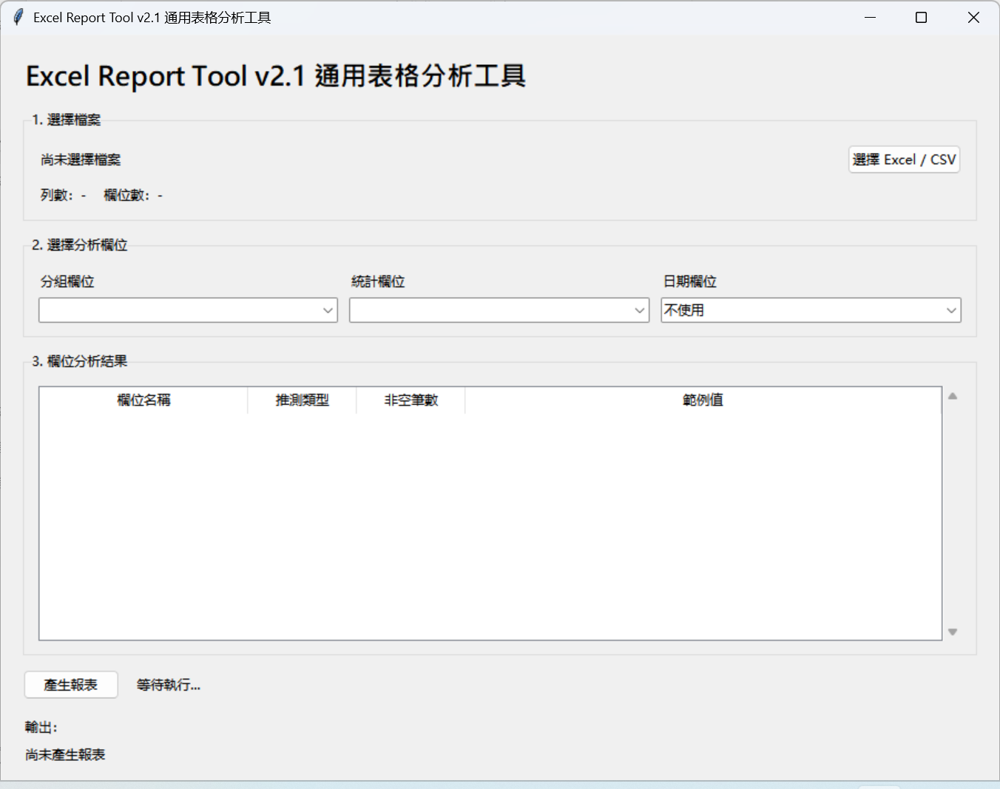
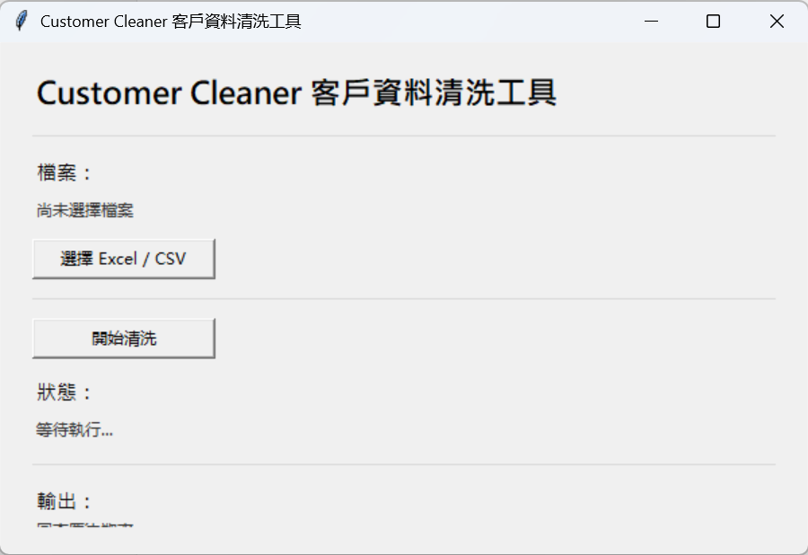
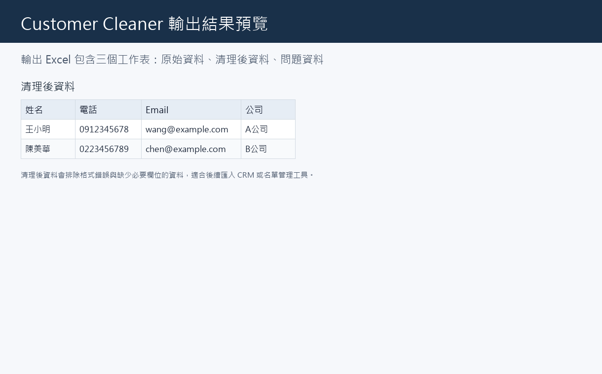

# Excel + Python 自動化工具作品集

## 我的定位

我是 **Excel + Python + 自動化工具開發者**，專注協助中小企業、個人工作室與營運團隊，把日常重複的 Excel、CSV、客戶資料與報表流程自動化。

這個作品集展示的重點不是學習筆記，而是我能用可執行工具解決哪些實際工作問題。

## 我能解決的問題

- Excel 資料整理耗時
- 每週或每月報表需要重複製作
- 客戶資料欄位混亂
- 電話、Email 格式不一致
- CSV / Excel 需要轉換與清理
- 手動複製貼上容易出錯
- 非技術人員需要按鈕式工具

## 可帶來的實際效益

- 將重複 Excel 整理流程改成按鈕式工具
- 減少資料清理與報表製作時間
- 降低手動複製貼上與公式錯誤
- 讓非技術人員也能自行產生乾淨報表
- 輸出可直接查看、篩選與交付的正式 Excel 報表

## 已完成作品

### 1. Excel Report Tool v2.1

通用 Excel / CSV 報表工具。使用者選擇檔案後，工具會讀取資料、清理空白列與重複資料，自動分析欄位類型，並讓使用者自行選擇分組欄位與統計欄位產生報表。

適合場景：

- 銷售資料整理
- 菜單 / 商品售價分析
- 支出與台賬整理
- 業務或代理人業績統計
- 每月例行 Excel 報表產出

核心功能：

- 支援 Excel / CSV
- Excel 固定讀取第一個工作表
- 清除全空白列
- 刪除重複資料
- 自動分析文字、數字、日期欄位
- 使用者自行選擇分組欄位、統計欄位、日期欄位
- 產生原始資料、清理後資料、統計報表
- 統計報表包含總覽、分組統計、月份統計、Top10 排行
- 支援常見金額格式，例如 `元`、`￥`、`NT$`、逗號

v2.1 報表美化：

- 自動調整欄寬
- 標題列加粗與背景色
- 明顯表格線
- 凍結首列
- 加入篩選器
- 金額千分位格式
- 日期格式統一為 `yyyy-mm-dd`
- Top10 加入排名欄
- 統計報表加入摘要區塊
- 所有工作表使用一致樣式

輸出結果：

- `原始資料`
- `清理後資料`
- `統計報表`

專案狀態：**v2.1 Release Candidate**

### 2. Customer Cleaner v1.0

客戶資料清洗工具，支援 Excel / CSV，能統一欄位名稱、清理電話格式、檢查 Email、刪除重複客戶，並輸出乾淨資料與問題資料。

適合場景：

- 客戶名單整理
- 活動報名資料清洗
- 電商客戶資料整理
- CRM 匯入前資料檢查

輸出結果：

- `原始資料`
- `清理後資料`
- `問題資料`

專案狀態：**Released v1.0**

### 3. Google Sheets Report Sync v1.0

Google Sheets 同步報表工具，支援讀取 Excel / CSV，清理資料、產生統計報表，並透過 Google Sheets API 同步到指定 Google Sheet。

適合場景：

- 遠端團隊共用報表
- 表單資料整理
- 雲端資料同步
- 多人協作資料統一

專案狀態：**Released v1.0**

## 成果預覽

### Excel Report Tool v2.1

v2.1 主畫面已補：



其餘 v2.1 流程截圖待補，預計包含：

- 選擇 Excel / CSV
- 欄位分析結果
- 欄位選擇
- 執行完成
- 清理後資料
- 統計報表
- Top10 排名
- 摘要區塊

目前保留既有 v1.0 截圖作為舊版流程參考：


### Customer Cleaner






## 安裝方式

```powershell
python -m pip install -r requirements.txt
```

## 執行方式

Excel Report Tool：

```powershell
python main.py
```

Customer Cleaner：

```powershell
cd customer-cleaner
python main.py
```

Google Sheets Report Sync：

```powershell
cd google-sheets-report-sync
python main.py
```

## 測試方式

```powershell
python -m pytest -q
```

## EXE 版本

Excel Report Tool v2.1 已可使用 PyInstaller 產生 Windows EXE：

```text
dist/ExcelReportTool.exe
```

目前狀態為 v2.1 Release Candidate，正式發布前仍建議補齊流程截圖與真實資料驗收。

打包流程請參考：

- `BUILD_EXE.md`
- `RELEASE_PLAN_v2.1.md`

## 適合合作對象

- 中小企業老闆
- 個人工作室
- 電商賣家
- 業務團隊
- 行政與財務人員
- 顧問、課程與服務型團隊
- 需要定期整理 Excel / CSV 的組織

## 我提供的價值

我擅長把「每天都在做、但不一定需要人工做」的表格流程轉成簡單工具。

可協助的工作包括：

- Excel 自動報表
- Excel / CSV 資料清理
- 客戶資料清洗
- Google Sheets 同步
- 小型內部工具開發

## 未來規劃

下一階段會優先完成：

- Excel Report Tool v2.1 正式 Release
- v2.1 EXE 客戶交付版本
- AI Customer Feedback Analyzer

AI 功能會等實際 AI 專案完成後，再正式升級作品集定位。
