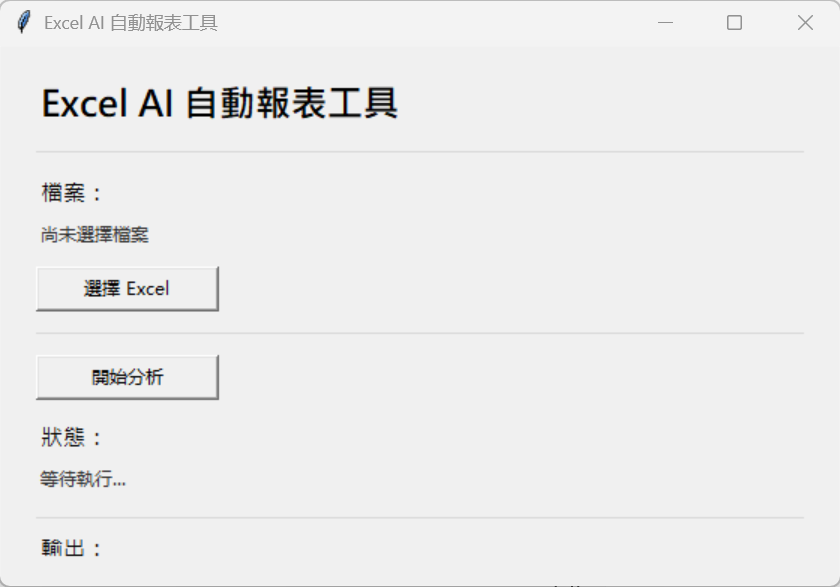
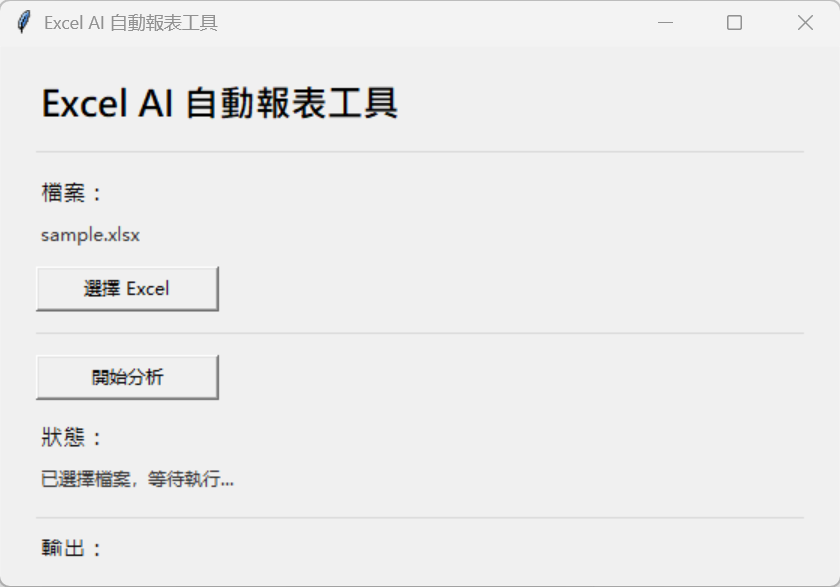
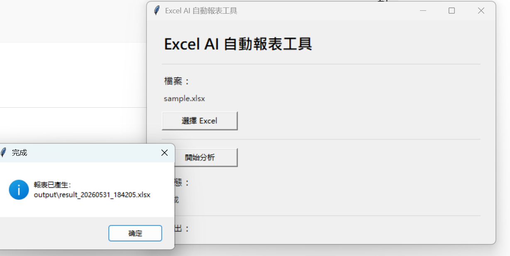
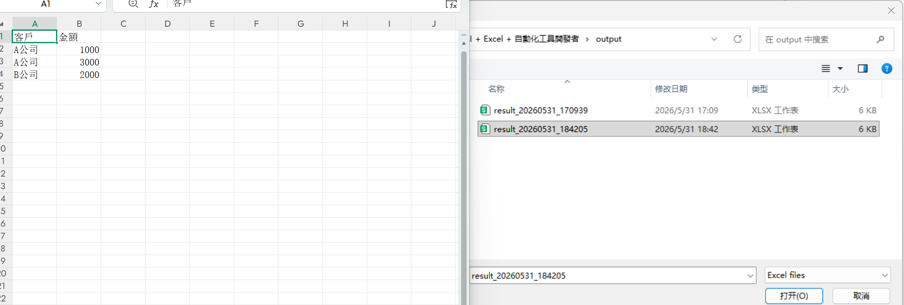

# Excel + Python 自動化工具作品集

## 我的定位

我是 **Excel + Python + 自動化工具開發者**，專注於協助中小企業、個人工作室與營運團隊，把日常重複的 Excel、CSV、客戶資料與報表流程自動化。

這個作品集展示的重點不是我學過哪些技術，而是我能用 Python、Excel 自動化與資料處理，解決哪些實際企業問題。AI 相關工具會在後續專案完成後再正式加入作品集定位。

## 我能解決的問題

很多企業日常工作仍依賴人工整理表格、複製貼上、篩選資料、去除重複、製作報表。這些流程雖然看起來簡單，卻容易耗費大量時間，也容易出現人為錯誤。

我目前聚焦解決以下問題：

- Excel 資料整理耗時
- 每週或每月報表需要重複製作
- 客戶資料欄位混亂
- 電話、Email 格式不一致
- 重複資料影響後續分析
- 非技術人員需要簡單可操作的工具
- 小型團隊需要低成本的流程自動化

## 可帶來的實際效益

- 將重複 Excel 整理流程改成按鈕式工具
- 減少資料清理與報表製作時間
- 降低手動複製貼上與公式錯誤
- 讓非技術人員也能自行產生乾淨報表

## 成果預覽

### Excel 自動報表工具

### Customer Cleaner

截圖待補：主畫面、選擇檔案、執行完成、清理後資料、問題資料。

## 已完成專案

### 1. Excel 自動報表工具

一個可執行的 Excel 報表自動化工具，使用者選擇 Excel 檔案後，工具會自動清除空白列、刪除重複資料，並依照客戶統計金額總和。

輸出結果包含：

- 原始資料
- 清理後資料
- 統計報表

適合場景：

- 銷售資料整理
- 訂單資料彙整
- 客戶交易金額統計
- 每月例行 Excel 報表產出

商業價值：

- 減少人工整理 Excel 的時間
- 降低手動計算錯誤
- 讓非技術使用者也能透過 GUI 完成報表產出
- 可作為中小企業內部報表自動化的雛形

使用案例：每月銷售報表整理

一家小型工作室每月收到銷售 Excel，資料包含重複資料、空白列與未整理資訊。使用本工具後，可以自動產生：

- 原始資料
- 清理後資料
- 客戶統計報表

專案狀態：**v1.0 已完成**

### 2. Customer Cleaner 客戶資料清洗工具

一個客戶名單清洗工具，支援 Excel / CSV，能自動統一欄位名稱、清理電話格式、檢查 Email、刪除重複客戶，並輸出乾淨資料與問題資料。

輸出結果包含：

- 原始資料
- 清理後資料
- 問題資料

適合場景：

- 客戶名單整理
- 活動報名資料清洗
- 電商客戶資料整理
- CRM 匯入前資料檢查
- Email 行銷名單前置清理

商業價值：

- 提升客戶資料品質
- 減少人工檢查 Email 與電話格式的時間
- 協助業務、行銷與行政團隊建立可用名單
- 降低錯誤資料進入後續系統的風險

專案狀態：**v1.0 已完成**

## 適合合作對象

這個作品集特別適合以下對象參考：

- 中小企業老闆
- 個人工作室
- 電商賣家
- 業務團隊
- 行政與財務人員
- 顧問、課程與服務型團隊
- 需要定期整理 Excel / CSV 的組織
- 尋找 Python 自動化能力的面試主管或技術主管

## 我提供的價值

我擅長把「每天都在做、但不一定需要人工做」的工作轉成簡單工具。

合作或專案開發可以從小範圍開始，例如：

- 整理一份固定格式的 Excel
- 自動產生一份月報
- 清理一批客戶資料
- 找出資料中的錯誤與重複
- 將人工流程轉成按鈕式工具

我的目標是先交付可執行版本，再逐步優化功能，而不是一開始就建立過度複雜的系統。

## 技術方向

目前作品集主要使用：

- Python
- pandas
- openpyxl
- tkinter
- pytest
- Excel / CSV 資料處理

技術只是手段，核心目標是讓資料整理、報表產出與日常流程更快、更穩定、更容易交付。

## 未來作品集規劃

接下來會依照實務價值逐步完成：

### 3. Google Sheets 自動同步報表

目標是支援雲端試算表資料處理，將 Google Sheets 中的資料自動整理、統計並回寫結果，適合遠端團隊與多人協作情境。

預計解決：

- 表單資料整理
- 雲端報表同步
- 多人共用資料表的自動清理
- 定期更新統計結果

### 4. AI 客戶回饋摘要工具

目標是讀取 Excel / CSV 中的大量文字回饋，使用 AI 協助分類、摘要與整理待處理重點。

預計解決：

- 客戶回饋量太大，人工閱讀耗時
- 不容易快速看出常見問題
- 客訴、建議、正面回饋需要分類
- 團隊需要可追蹤的改善重點

## 作品集目標

這個 repository 會持續累積能展示、能執行、能接案的自動化工具。

目前方向是建立一套完整的 **Excel + Python 自動化工具作品集**，能協助中小企業把重複性資料工作轉成穩定、可操作、可擴充的工具流程。待 AI 客戶回饋摘要工具完成後，再升級為 **AI + Excel + Python 自動化工具作品集**。
