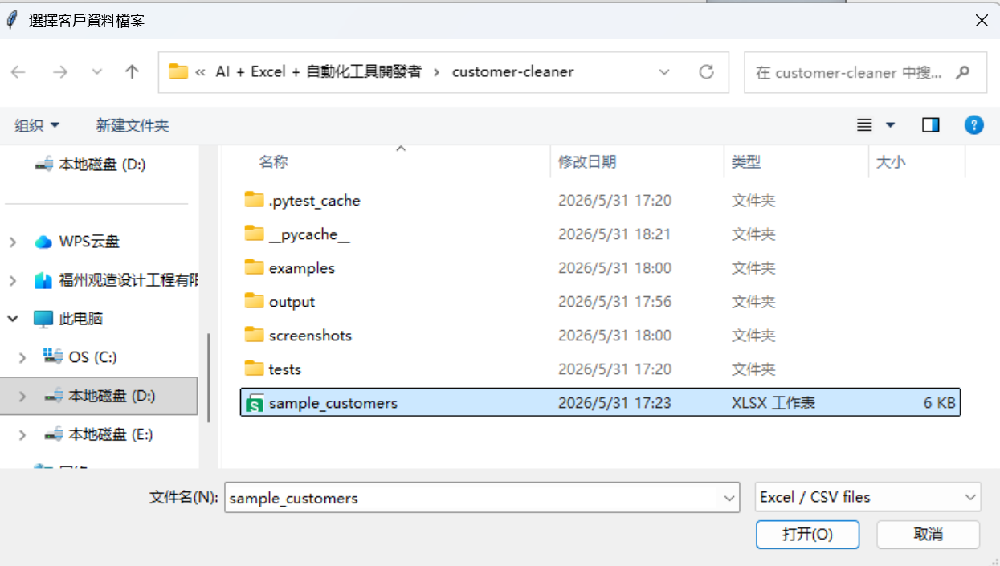
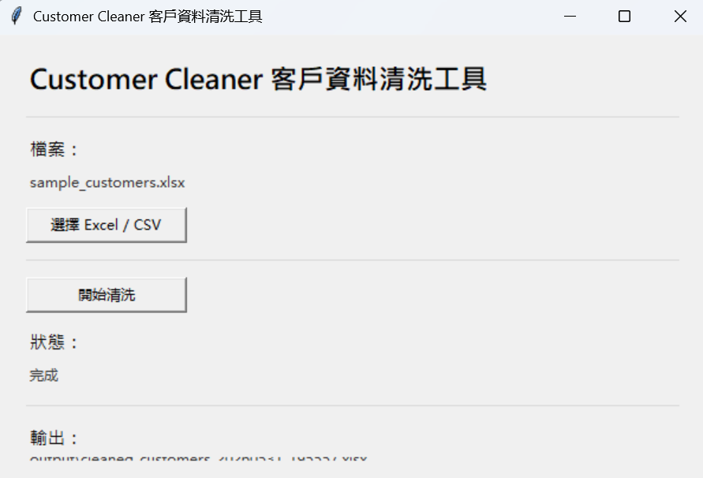
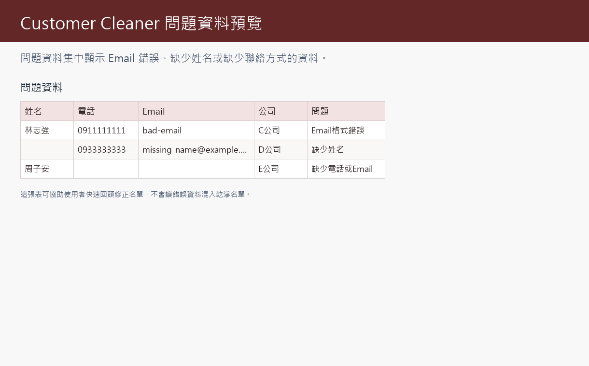

# Customer Cleaner 客戶資料清洗工具

目前版本：v1.0

這是作品集第二個專案：用 Python 自動整理客戶名單，將 Excel 或 CSV 中格式混亂的客戶資料清洗成可用的名單。

## 專案介紹

Customer Cleaner 是一個客戶資料清洗工具，提供簡單 GUI，讓使用者選擇 Excel 或 CSV 檔案後，自動整理欄位名稱、清理電話格式、檢查 Email、排除問題資料並輸出乾淨名單。它適合展示資料清洗、名單整理與中小企業自動化能力。

## 成果展示

### 主畫面

使用者可以透過簡單的 GUI 選擇 Excel 或 CSV 檔案，不需要操作命令列。


### 選擇檔案

工具支援選擇 `.xlsx`、`.xlsm` 與 `.csv` 客戶資料檔。



### 執行完成

清洗完成後，畫面會顯示狀態與輸出檔案位置，方便使用者直接找到結果。



### 輸出結果

輸出 Excel 會包含 `原始資料`、`清理後資料`、`問題資料` 三個工作表。


### 問題資料

問題資料會集中列出 Email 錯誤、缺少姓名或缺少聯絡方式的資料，方便回頭修正。



## 功能特色

第一版聚焦最常見、最容易接案的客戶資料清洗需求：

1. 支援 Excel / CSV
2. 清除全空白列
3. 統一欄位名稱：`姓名`、`電話`、`Email`、`公司`
4. 刪除重複客戶
5. 檢查 Email 格式
6. 清理電話格式
7. 產生 `output/cleaned_customers_YYYYMMDD_HHMMSS.xlsx`
8. 輸出三個工作表：`原始資料`、`清理後資料`、`問題資料`

## 商業價值

很多中小企業、個人工作室、活動主辦方或電商會累積客戶名單，但資料常常來自不同來源，例如表單、Line、活動報名、人工輸入或舊 Excel。這些資料可能有重複客戶、電話格式不一致、Email 錯誤或欄位名稱混亂。

這個工具可以幫客戶快速整理名單，讓資料更適合後續匯入 CRM、Email 行銷工具、業務追蹤表或內部報表。

## 使用案例

案例：活動報名名單清洗

活動主辦方匯出名單後常出現：

- 電話格式不一致
- Email 格式錯誤
- 重複報名

使用 Customer Cleaner 後，自動產生：

- 乾淨名單
- 問題資料

## 專案結構

```text
customer-cleaner/
├── main.py
├── ui.py
├── cleaner.py
├── validator.py
├── exporter.py
├── requirements.txt
├── pytest.ini
├── README.md
├── CHANGELOG.md
├── screenshots/
├── examples/
└── tests/
    ├── test_cleaner.py
    ├── test_validator.py
    └── test_exporter.py
```

檔案用途：

- `main.py`：程式入口，啟動 GUI。
- `ui.py`：tkinter 視窗，負責選擇檔案、開始清洗、顯示狀態。
- `cleaner.py`：讀取 Excel / CSV、欄位標準化、清除空白列、清理電話、刪除重複客戶。
- `validator.py`：檢查 Email 格式，產生問題資料。
- `exporter.py`：輸出 Excel 報表。
- `screenshots/`：預留 GitHub 展示截圖。
- `examples/`：放範例輸入檔與輸出說明。
- `pytest.ini`：限制測試只執行本專案的 `tests/`。
- `tests/`：自動測試，確認清洗、驗證與輸出邏輯正確。

## 範例輸入格式

支援檔案：

- `.xlsx`
- `.xlsm`
- `.csv`

建議欄位：

| 姓名 | 電話 | Email | 公司 |
| --- | --- | --- | --- |
| 王小明 | 0912-345-678 | wang@example.com | A公司 |
| 陳美華 | (02) 2345-6789 | chen@example.com | B公司 |

第一版會將常見欄位名稱統一成：

- `姓名`
- `電話`
- `Email`
- `公司`

支援的常見別名包含：

- 姓名：`客戶`、`客戶姓名`、`名稱`、`name`
- 電話：`手機`、`聯絡電話`、`phone`、`mobile`
- Email：`電子郵件`、`信箱`、`email`、`e-mail`
- 公司：`公司名稱`、`company`

## 清洗規則

- 移除全空白列。
- 電話只保留數字，例如 `0912-345-678` 會變成 `0912345678`。
- Email 會去除前後空白並轉成小寫。
- Email 格式錯誤會放入 `問題資料`。
- 缺少姓名會放入 `問題資料`。
- 電話和 Email 都缺少會放入 `問題資料`。
- 清理後資料會排除問題資料，並依 `姓名`、`電話`、`Email` 刪除重複客戶。

## 安裝方式

建議使用 Python 3.10 以上版本。

```powershell
python -m pip install -r requirements.txt
```

如果你的電腦使用 `py` 啟動 Python：

```powershell
py -m pip install -r requirements.txt
```

## 執行方式

```powershell
python main.py
```

或：

```powershell
py main.py
```

操作流程：

1. 按「選擇 Excel / CSV」
2. 選擇客戶資料檔
3. 按「開始清洗」
4. 等待狀態顯示完成
5. 到 `output/` 資料夾查看結果

## 範例輸出說明

每次執行都會產生新的檔案：

```text
output/cleaned_customers_YYYYMMDD_HHMMSS.xlsx
```

輸出檔包含：

- `原始資料`：原本讀進來的資料。
- `清理後資料`：格式清理、排除問題資料、刪除重複後的資料。
- `問題資料`：Email 錯誤、缺少姓名、缺少聯絡方式的資料。

## 執行測試

```powershell
python -m pytest -q
```

或：

```powershell
py -m pytest -q
```

測試會確認：

- 可以讀取 CSV
- 可以讀取 Excel
- 可以統一欄位名稱
- 可以清除空白列
- 可以清理電話格式
- 可以刪除重複客戶
- 可以檢查 Email
- 可以輸出三個工作表

## 重要程式碼理解

`cleaner.py` 的重點：

```python
normalized_df = normalize_columns(df)
```

這行會把不同來源的欄位名稱統一成 `姓名`、`電話`、`Email`、`公司`。

```python
normalized_df["電話"] = normalized_df["電話"].map(clean_phone)
```

這行會把電話中的空白、括號、破折號移除，只留下數字。

`validator.py` 的重點：

```python
EMAIL_PATTERN.match(email)
```

這行用來檢查 Email 是否符合基本格式。

`exporter.py` 的重點：

```python
pd.ExcelWriter(report_path, engine="openpyxl")
```

這行用來建立新的 Excel 檔案，並寫入三個工作表。

## 未來規劃

後續版本可以增加：

- 更進階的電話國碼規則
- 更複雜的重複客戶合併邏輯
- 可自訂欄位對應
- 批次處理多個檔案

## v1.0 尚未包含

第一版先不加入：

- AI 摘要
- PDF
- 圖表
- EXE 打包
- Google Sheets 串接
- CRM API 串接
