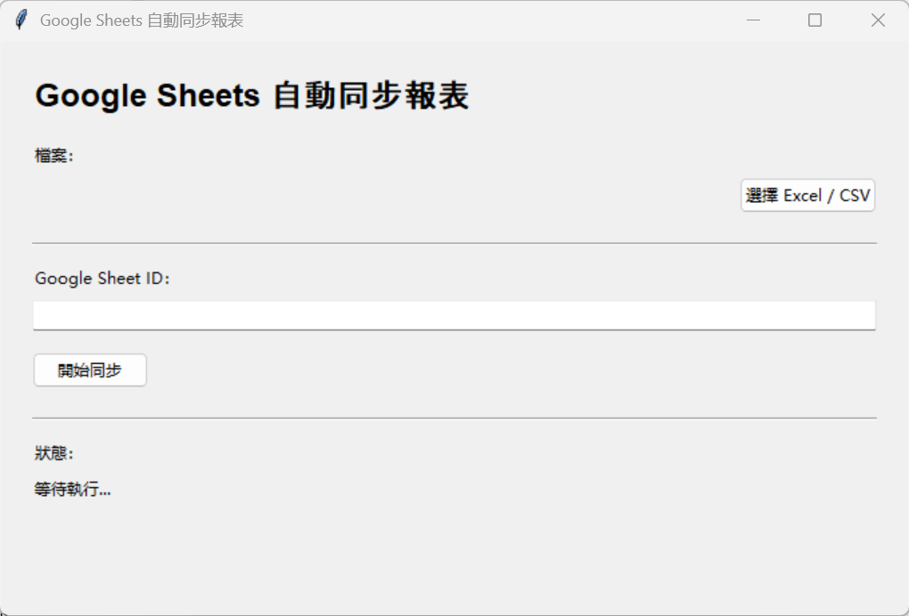
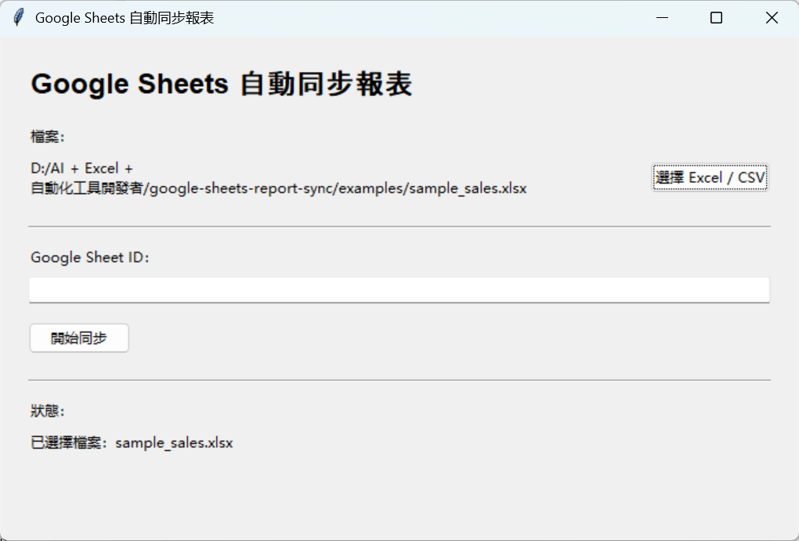
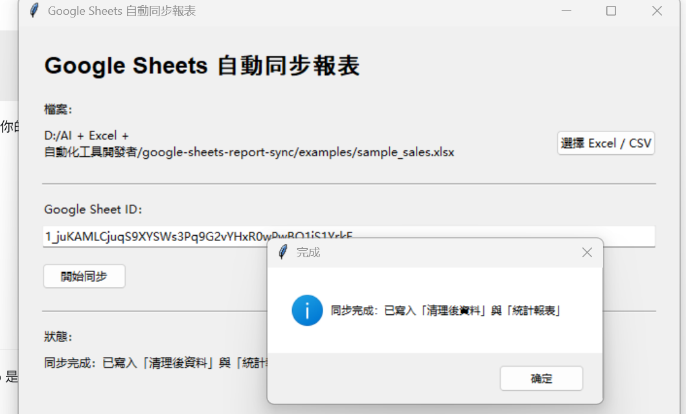
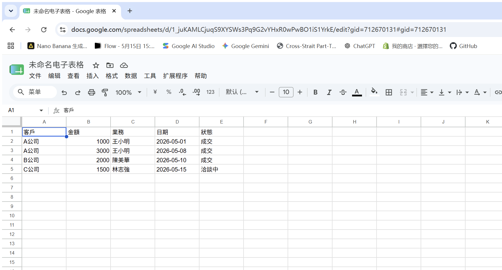
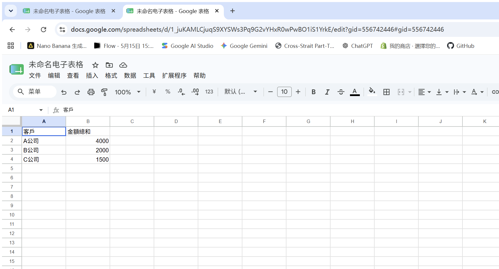

# Google Sheets Report Sync

Google Sheets Report Sync 是一個 Python 桌面工具，用來把 Excel / CSV 的銷售資料清理後，自動同步到指定的 Google Sheets。

這個專案是作品集第三個自動化工具，定位是「Excel + Python + Google Sheets 自動化」。v1.0 重點是跑通完整流程：選擇檔案、清理資料、產生統計報表、OAuth 授權、寫入 Google Sheets。

## 商業價值

許多中小企業會先用 Excel 或 CSV 收集銷售資料，再手動整理、加總、複製到 Google Sheets 與團隊共享。這個流程容易產生版本混亂、複製貼上錯誤，也會浪費行政與業務人員時間。

本工具可以帶來的效益：

- 將 Excel / CSV 整理流程改成按鈕式操作
- 自動清除空白列與重複資料
- 自動依客戶統計金額總和
- 將清理後資料與統計報表同步到 Google Sheets
- 減少人工複製貼上與公式錯誤
- 讓非技術人員也能產生可共享的雲端報表

## 使用案例

### 每週銷售資料同步

一家小型工作室每週會從內部系統匯出銷售 Excel，資料中可能包含空白列、重複資料與未整理的客戶金額資訊。

使用 Google Sheets Report Sync 後，負責人只需要：

1. 選擇 Excel / CSV 檔案
2. 貼上 Google Sheet ID
3. 按下「開始同步」

工具會自動產生並同步：

- 清理後資料
- 統計報表

這讓主管、業務與行政人員可以直接在 Google Sheets 查看最新報表。

## v1.0 功能特色

- 支援 Excel / CSV
- Excel 固定讀取第一個工作表
- 清除全空白列
- 刪除完全重複資料
- 檢查必要欄位：`客戶`、`金額`
- 依照 `客戶` 統計 `金額` 總和
- 使用者可輸入 Google Sheet ID
- 寫入 Google Sheets 兩個工作表：`清理後資料`、`統計報表`
- 使用 Google OAuth 本機授權流程
- 建立簡單 tkinter GUI
- 顯示同步成功或失敗訊息
- 建立 pytest 測試

## 成果展示

### 工具主畫面



### 選擇 Excel / CSV 檔案



### 同步完成



### Google Sheets：清理後資料



### Google Sheets：統計報表



## 範例輸入格式

至少需要包含以下欄位：

| 客戶 | 金額 |
| --- | ---: |
| A公司 | 1000 |
| A公司 | 3000 |
| B公司 | 2000 |
| C公司 | 1500 |

專案內已提供範例檔：

```text
examples/sample_sales.xlsx
```

## 範例輸出說明

同步成功後，Google Sheets 會建立或更新兩個工作表：

```text
清理後資料
統計報表
```

`統計報表` 範例結果：

| 客戶 | 金額總和 |
| --- | ---: |
| A公司 | 4000 |
| B公司 | 2000 |
| C公司 | 1500 |

## 安裝方式

```powershell
python -m pip install -r requirements.txt
```

如果你的電腦使用 `py` 啟動 Python：

```powershell
py -m pip install -r requirements.txt
```

## Google Sheets API 設定

v1.0 使用本機 OAuth 授權流程，需要：

- `credentials.json`
- `token.json`

這兩個檔案包含授權資訊，不應上傳到 GitHub。本專案已在 `.gitignore` 排除：

```text
credentials.json
token.json
```

### 建立 credentials.json

1. 前往 Google Cloud Console。
2. 建立或選擇專案。
3. 啟用 Google Sheets API。
4. 設定 OAuth 同意畫面。
5. 建立 OAuth Client ID。
6. Application type 選擇 Desktop app。
7. 下載 JSON 檔。
8. 將檔名改成 `credentials.json`。
9. 放在專案根目錄：

```text
google-sheets-report-sync/credentials.json
```

### token.json 何時產生

第一次執行同步時，程式會開啟 Google OAuth 授權頁面。授權成功後，會自動在專案根目錄產生：

```text
google-sheets-report-sync/token.json
```

## 執行方式

請先確認 `credentials.json` 已放在專案根目錄。

```powershell
python main.py
```

操作流程：

1. 按「選擇 Excel / CSV」。
2. 選擇 `examples/sample_sales.xlsx` 或自己的資料檔。
3. 貼上 Google Sheet ID。
4. 按「開始同步」。
5. 第一次執行時完成 Google OAuth 授權。
6. 回到 Google Sheets 查看 `清理後資料` 與 `統計報表`。

## 測試方式

```powershell
python -m pytest -q
```

測試涵蓋：

- Excel / CSV 資料清理
- 空白列清除
- 重複資料刪除
- 必要欄位檢查
- 客戶金額統計
- Google Sheets payload 格式
- Google Sheets API 呼叫流程的單元測試

## 專案結構

```text
google-sheets-report-sync/
├── main.py
├── ui.py
├── cleaner.py
├── report.py
├── sheets_client.py
├── config.py
├── requirements.txt
├── README.md
├── RELEASE_NOTES_v1.0.md
├── GITHUB_PUBLISH_CHECKLIST.md
├── .gitignore
├── examples/
│   └── sample_sales.xlsx
├── screenshots/
│   ├── README.md
│   ├── main-screen.png
│   ├── selected-file.png
│   ├── completed.png
│   ├── google-sheets-result.png
│   └── google-sheets-summary-result.png
└── tests/
    ├── test_cleaner.py
    ├── test_report.py
    └── test_sheets_payload.py
```

## 發佈前安全檢查

上傳 GitHub 前請確認：

- `credentials.json` 沒有被 Git 追蹤
- `token.json` 沒有被 Git 追蹤
- `output/` 沒有被 Git 追蹤
- README 圖片路徑可正常顯示
- `python -m pytest -q` 全部通過

## v1.0 不包含

- AI 摘要
- PDF
- 圖表
- 自動排程
- EXE 打包
- 多帳號管理
- CRM 串接

## 未來規劃

- 支援更彈性的欄位對應
- 支援更多報表格式
- 加入同步紀錄
- 加入錯誤資料輸出
- 未來作品集階段再加入 AI 摘要功能
